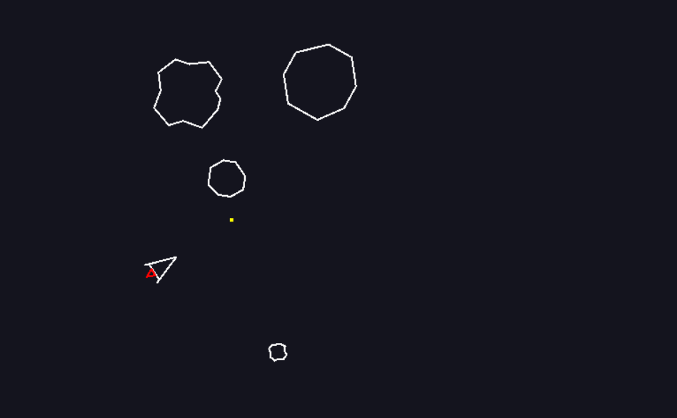

# Kaplay Example - Asteroids

A simple Asteroids game using [Kaplay](https://kaplayjs.com/docs/guides/)



## Project Structure

Looking at how best to architect the project in terms of files / folders / separation of concerns / etc. Have settled on this...


```
├── README.md            # Project README
│
├── index.html           # Hosting page
│
├── main.js              # Game setup and entry point
│
├── scenes/              # All game scenes
│   ├── splash.js
│   ├── game.js
│   └── gameOver.js
│
├── entities/            # All game entities
│   ├── ship.js
│   ├── bullet.js
│   └── asteroid.js
│
└── assets/              # Other game assets
    ├── images/
    ├── sounds/
    └── fonts/
```

This works well for separation of game parts in a logical, but not overwhelming way:
- **Entities** are defined, but just as data / info. Behaviour is within scenes
- **Scenes** create required entities and handle game inputs / collisions / etc.


